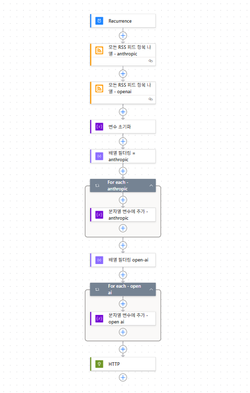

# 목표  
RSS 를 활용해서 Power Automate  에서 
매일 오전 7시에 RSS 추가한 사이트에 올라온 글 제목, 요약, 시간, 링크등을 Teams 채널로 전달하는 프로세스 개발 

# 최종 완성본  

# 상세 

1. Power Automate 에서 예약된 클라우드 흐름을 생선한다. 
2. Recurrence 의 매개변수에 빈도수를 세팅하며 하루에 1번 서울 시간 기준으로 7시에 발생하도록 세팅해준다.
3. 모든 RSS 피드 항목 나열에서 RSS 피드 URL 에 원하는 rss URL 을 추가한다. 
   ex) https://raw.githubusercontent.com/taobojlen/anthropic-rss-feed/main/anthropic_news_rss.xml
4. 변수 초기화를 통해 기존에 남아있는 데이터를 모두 깔끔히 삭제
5. rss 는 사이트마다 올 수 있는 데이터의 숫자가 다르기 때문에 필터링을 통해 필요한 데이터를 걸러낸다. 
   ex) From 에는 어떤 항목나열로부터 올지 Filter Query 에는 답변에서 어떤 컬럼을 기준으로 걸러낼지를 선택
6. 분자열 변수를 추가하여 어떤 형태로 메시지가 올지에 대해서 매개변수 Value 에 추가한다. 

7. HTTP 에 매개변수에 URL 및 Method (POST) Headers (Content-Type : application/json) 등을 추가
- URL : Teams 에서 채널을 만들고 채널 이름 옆 ... 클릭 -> 워크플로 클릭 -> 검색창에 webhook 또는 HTTP 입력 -> When a Teams webhook request is received 선택 -> 플로우 저장 시 URL 자동 생성 됨 복사한 URL 을 붙여넣음 
- Body : {
   "type": "message",
   "attachments": [
   {
   "contentType": "application/vnd.microsoft.card.adaptive",
   "contentUrl": null,
   "content": {
   "$schema": "http://adaptivecards.io/schemas/adaptive-card.json",
   "type": "AdaptiveCard",
   "version": "1.2",
   "body": [
   {
   "type": "TextBlock",
   "text": "📰 AI 뉴스 브리핑",
   "weight": "Bolder",
   "size": "Large"
   },
   {
   "type": "TextBlock",
   "text": "@{variables('뉴스목록')}",
   "wrap": true
   }
   ]
   }
   }
   ]
   }

